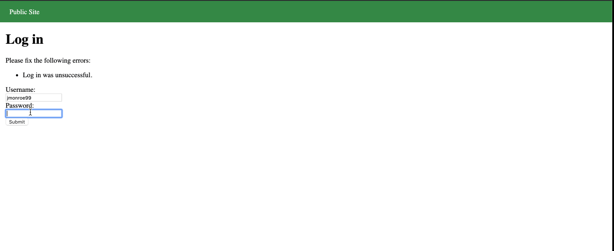
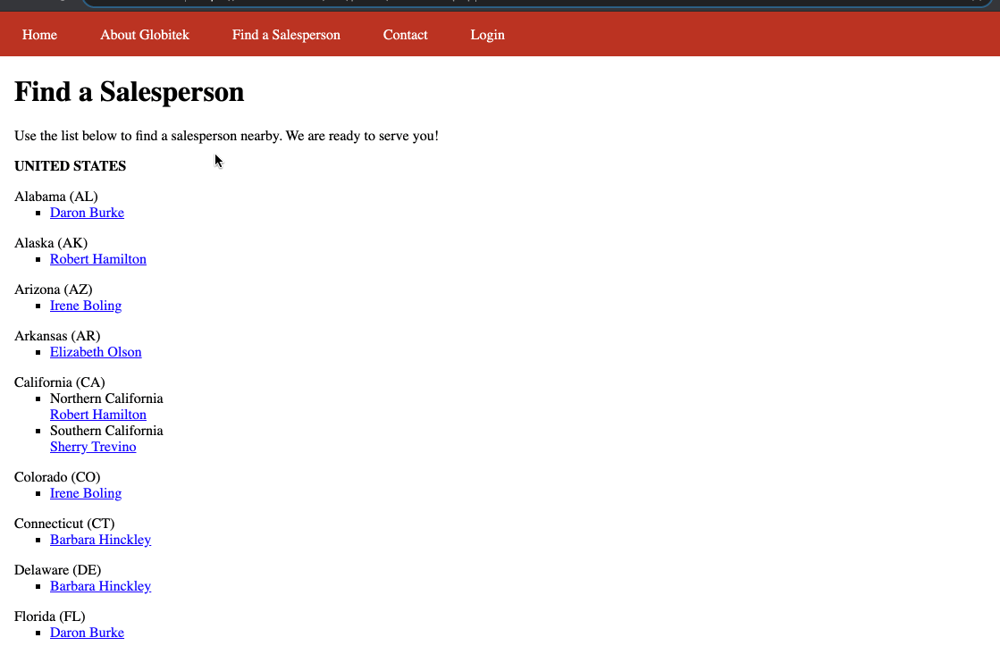
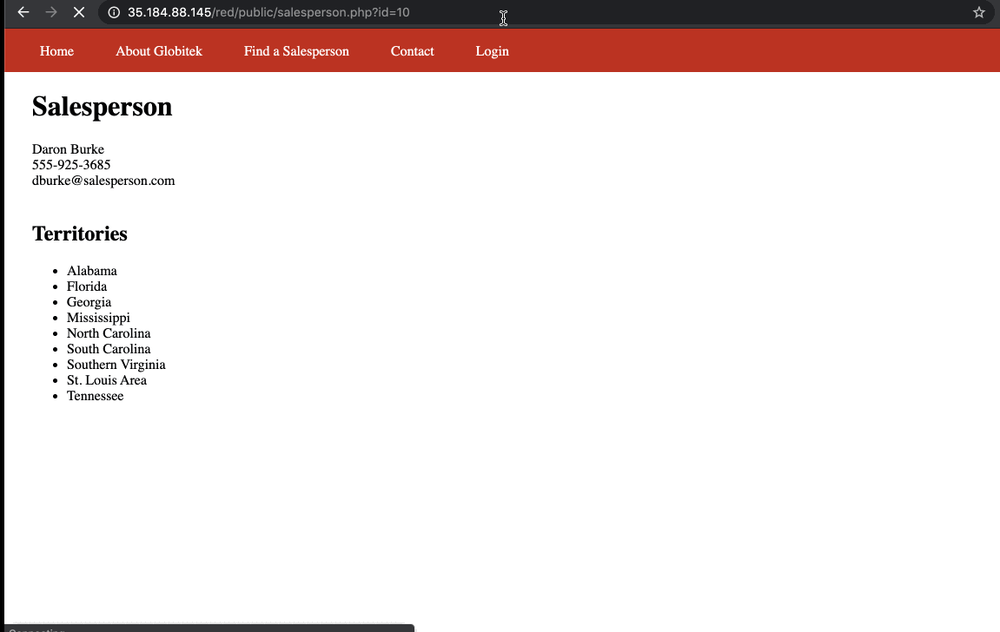

# Project 8 - Pentesting Live Targets

Time spent: 3 hours spent in total

> Objective: Identify vulnerabilities in three different versions of the Globitek website: blue, green, and red.

The six possible exploits are:

* Username Enumeration
* Insecure Direct Object Reference (IDOR)
* SQL Injection (SQLi)
* Cross-Site Scripting (XSS)
* Cross-Site Request Forgery (CSRF)
* Session Hijacking/Fixation

Each color is vulnerable to only 2 of the 6 possible exploits. First discover which color has the specific vulnerability, then write a short description of how to exploit it, and finally demonstrate it using screenshots compiled into a GIF.

## Green

Vulnerability #1: Username Enumeration

Description: Username jmonroe99 does not exist and it says login unsuccessful. When it does exist, it gets a bolded text

Vulnerability #2: SQL Injection

Description: Attempted to change id=1 to ?id=' OR 1=1' on url. It returned an alert saying that the sql query failed.

## Red

Vulnerability #1: IDOR

Description: Change id= inside url and discovered accounts I shouldn't have access to.

Vulnerability #2: __________________

Description:

## Blue

Vulnerability #1: Session_Hijacking

Description:

Vulnerability #2: __________________

Description:

## Notes

Describe any challenges encountered while doing the work
